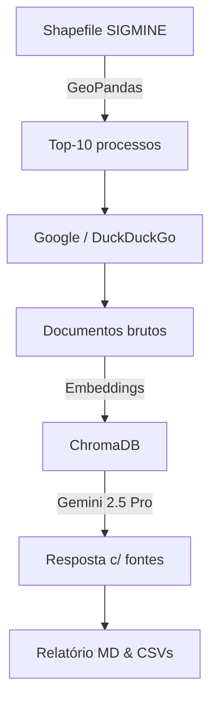

[](https://www.python.org) 
[](LICENSE) 
[](https://colab.research.google.com/) 
[]()

> **sigmine‑rag‑insights** automatiza a análise de processos minerários do SIGMINE.  
> Ele lê o shapefile completo, calcula áreas, prioriza os maiores processos e executa um fluxo **RAG** (Retrieval-Augmented Generation) que busca evidências na web e gera relatórios markdown e CSV — tudo pronto para jornalismo investigativo e fiscalização ambiental.

---

## sumário
1. [Visão geral](#visão-geral)
2. [Instalação](#instalação)
3. [Estrutura de pastas](#estrutura-de-pastas)
4. [Como usar](#como-usar)
5. [Saídas geradas](#saídas-geradas)
6. [Notebook Colab](#notebook-colab)
7. [Fontes de dados abertas](#fontes-de-dados-abertas)
8. [Fluxo do processo](#fluxo-do-processo)
9. [Limitações & ética](#limitações-e-ética)
10. [Créditos](#créditos)

---

## visão geral
Scripts apresentados no **Domingo de Dados 2025** na atividade [Investigando dados ambientais: compliance e anticorrupção](https://congresso.abraji.org.br/mesa/investigando-dados-ambientais-compliance-e-anticorrupcao), que apresentou o estudo ["Dados Abertos e Combate a Crimes Ambientais"](https://www.abraji.org.br/publicacoes/dados-abertos-e-combate-a-crimes-ambientais) (Transparência Internacional Brasil, Abraji e ICV como autores)

Veja os [slides da apresentação](http://bit.ly/4eC31Bo)

E neste repositório dentro da pasta **prompts_orientacoes** existem dois documentos que oferecem, de forma integrada, um guia prático com 10 orientações e exemplos de investigações para jornalistas usarem dados ambientais abertos, além de um conjunto de prompts e boas práticas de IA (RAG, LLMs e Google Colab) que amplificam análises minerárias, fundiárias e de compliance, garantindo rigor metodológico, eficiência técnica e respeito ético.

**Sobre o projeto**

O SIGMINE, cadastro oficial da Agência Nacional de Mineração, lista **255 230 processos** que cobrem cerca de **218 milhões de hectares** em todo o Brasil (downloads feitos 1o. de julho de 2025).  
Este repositório oferece:

* **Geoprocessamento:** reprojeta o shapefile (EPSG 5880), calcula área e seleciona os top‑10 processos por extensão.
* **Busca contextual (RAG):** consulta Google Custom Search (ou DuckDuckGo como fallback) com _dorks_ temáticos, salva documentos no ChromaDB e usa **Gemini 2.5 Pro** via LangChain para resumir e citar fontes.
* **Relatórios automáticos:** gera um markdown (`relatorio_sigmine_contexto.md`) e dois CSV (`analise_sigmine_resultados.csv`, `descobertas_impactos_detalhadas.csv`).

Ideal para **jornalistas, órgãos de controle, ONGs e pesquisadores** que precisam identificar impactos socioambientais, titulares reincidentes e sobreposições críticas (TI, UC, CAR).

---

## instalação
```bash
git clone https://github.com/<seu_usuario>/sigmine-rag-insights.git
cd sigmine-rag-insights
python -m venv .venv && source .venv/bin/activate
pip install -r requirements.txt
```

Copie o shapefile SIGMINE (`BRASIL.shp` e arquivos auxiliares) para `data/BRASIL/`.  
Crie um arquivo `.env` com suas chaves (opcional):

```
GOOGLE_API_KEY=YOUR_API_KEY
GOOGLE_CSE_ID=YOUR_CSE_ID
```

Sem chaves, o script usa DuckDuckGo automaticamente.

---

## estrutura de pastas
```text
sigmine-rag-insights/
│
├─ main.py               # pipeline principal
├─ analisa_sigmine.ipynb # notebook Colab complementar
├─ requirements.txt
├─ data/
│   └─ BRASIL/BRASIL.shp # shapefile SIGMINE (baixar da ANM)
└─ output/               # relatórios e csvs gerados (criado em runtime)
```

---

## como usar
```bash
python main.py
```
Variáveis no topo de `main.py` permitem alterar o caminho do shapefile, a pasta de saída e o nome do relatório.

---

## saídas geradas
| arquivo | descrição |
|---------|-----------|
| `relatorio_sigmine_contexto.md` | resumo dos 10 maiores processos, titulares e impactos citados |
| `analise_sigmine_resultados.csv` | métricas linha‑a‑linha por processo (área, # fontes, links) |
| `descobertas_impactos_detalhadas.csv` | todas as evidências coletadas com URL, trecho e query |

---

## notebook colab
Abra **`analisa_sigmine.ipynb`** no Google Colab para análises avançadas:

* Carrega todo o micro‑dado (255 230 processos).
* Oferece filtros dinâmicos por substância, status e UF.
* Demonstra estudo de caso **803.237/2022** com múltiplos responsáveis e 6 municípios afetados.
* Gera estatísticas: histogramas de área, top titulares, heatmap Brasil.

---

## fontes de dados abertas
| dataset | descrição | link |
|---------|-----------|------|
| **SIGMINE** | Metadados e shapefile oficial de processos minerários ativos no Brasil | https://dados.gov.br/dados/conjuntos-dados/sistema-de-informacoes-geograficas-da-mineracao- |
| **Cadastro Mineiro (SCM)** | Cadastro de requerentes e microdados detalhados dos processos | https://dados.gov.br/dados/conjuntos-dados/sistema-de-cadastro-mineiro |
| **Microdados SCM** | Download direto dos microdados CSV | https://app.anm.gov.br/dadosabertos/SCM/microdados/ |
| **Municípios do Brasil – IBGE** | Tabela CSV com IBGE ID, nome, UF e geocódigo de todos os municípios brasileiros | https://raw.githubusercontent.com/kelvins/municipios-brasileiros/master/csv/municipios.csv |

---

## fluxo do processo


---

## limitações e ética
* Ausência de resultados na busca não significa falta de impacto — confirme em campo.
* Refaça as buscas você mesmo a partir do conteúdo da coluna "query_busca" do CSV para ter certeza se são relavantes ou não - cheque tudo!
* O resultado de uma busca na internet pode variar de acordo com dia, mês, ano, da busca. 
* Cotas gratuitas da Google CSE são limitadas; ao estourá‑las, a qualidade de busca pode cair.  
* Modelos generativos podem conter erros factuais; confirme URLs antes de publicar.  
* Envolva comunidades afetadas antes de divulgar denúncias baseadas nesta ferramenta.

---

## créditos
* **Reinaldo Chaves** – reichaves@gmail.com  
* Dados SIGMINE – Agência Nacional de Mineração.  
* Cadastro Mineiro SCM – ANM.  
* Municípios IBGE – repositório kelvins/municipios-brasileiros.  
* PRODES/DETER – INPE TerraBrasilis.  
* README usa [Shields.io](https://shields.io) e Mermaid nativo do GitHub.

> _“Dados públicos + IA == jornalismo ambiental mais poderoso.”_  
Contribuições são bem‑vindas!
