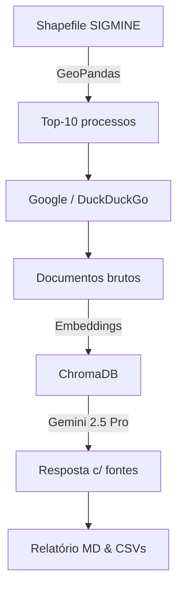

[](https://www.python.org) 
[](LICENSE) 
[](https://colab.research.google.com/) 
[]()

> **sigmine‑rag‑insights** automatiza a análise de processos minerários do SIGMINE.  
> Ele lê o shapefile completo, calcula áreas, prioriza os maiores processos e executa um fluxo **RAG** que busca evidências na web e gera relatórios markdown e CSV — tudo pronto para jornalismo investigativo e fiscalização ambiental.

---

## sumário
1. [Visão geral](#visão-geral)
2. [Instalação](#instalação)
3. [Estrutura de pastas](#estrutura-de-pastas)
4. [Como usar](#como-usar)
5. [Saídas geradas](#saídas-geradas)
6. [Notebook Colab](#notebook-colab)
7. [Fluxo do processo](#fluxo-do-processo)
8. [Limitações & ética](#limitações--ética)
9. [Créditos](#créditos)

---

## visão geral
O SIGMINE, cadastro oficial da Agência Nacional de Mineração, lista **255 230 processos** que cobrem cerca de **218 milhões de hectares** na Amazônia Legal e em todo o Brasil.  
Este repositório oferece:

* **Geoprocessamento:** reprojeta o shapefile (EPSG 5880), calcula área e seleciona os top‑10 processos por extensão.
* **Busca contextual (RAG):** consulta Google Custom Search (ou DuckDuckGo como fallback) com _dorks_ temáticos, salva documentos no ChromaDB e usa **Gemini 2.5 Pro** via LangChain para resumir e citar fontes.
* **Relatórios automáticos:** gera um markdown executivo (`relatorio_sigmine_contexto.md`) e dois CSV (`analise_sigmine_resultados.csv`, `descobertas_impactos_detalhadas.csv`).

Ideal para **jornalistas, órgãos de controle, ONGs e pesquisadores** que precisam identificar impactos socioambientais, titulares reincidentes e sobreposições críticas (TI, UC, CAR).

---

## instalação
```bash
git clone https://github.com/<seu_usuario>/sigmine-rag-insights.git
cd sigmine-rag-insights
python -m venv .venv && source .venv/bin/activate
pip install -r requirements.txt
```

Copie o shapefile SIGMINE (`BRASIL.shp` e arquivos auxiliares) para `data/BRASIL/`.  
Crie um arquivo `.env` com suas chaves (opcional):

```
GOOGLE_API_KEY=YOUR_API_KEY
GOOGLE_CSE_ID=YOUR_CSE_ID
```

Sem chaves, o script usa DuckDuckGo automaticamente.

---

## estrutura de pastas
```text
sigmine-rag-insights/
│
├─ main.py               # pipeline principal
├─ analisa_sigmine.ipynb # notebook Colab complementar
├─ requirements.txt
├─ data/
│   └─ BRASIL/BRASIL.shp # shapefile SIGMINE (baixar da ANM)
└─ output/               # relatórios e csvs gerados (criado em runtime)
```

---

## como usar
```bash
python main.py
```
Variáveis no topo de `main.py` permitem alterar o caminho do shapefile, a pasta de saída e o nome do relatório.

---

## saídas geradas
| arquivo | descrição |
|---------|-----------|
| `relatorio_sigmine_contexto.md` | resumo dos 10 maiores processos, titulares e impactos citados |
| `analise_sigmine_resultados.csv` | métricas linha‑a‑linha por processo (área, # fontes, links) |
| `descobertas_impactos_detalhadas.csv` | todas as evidências coletadas com URL, trecho e query |

---

## notebook colab
Abra **`analisa_sigmine.ipynb`** no Google Colab para análises ad‑hoc:

* Carrega todo o micro‑dado (255 230 processos).
* Oferece filtros dinâmicos por substância, status e UF.
* Demonstra estudo de caso **803.237/2022** com múltiplos responsáveis e 6 municípios afetados.
* Gera estatísticas: histogramas de área, top titulares, heatmap Brasil.

---

## fluxo do processo


---

## limitações & ética
* Falta de resultado na busca ≠ inexistência de impacto — confirme sempre com fontes locais.  
* Google CSE tem cota gratuita limitada; ao estourar, a qualidade cai para DuckDuckGo.  
* Modelos generativos podem conter erros factuais; verifique as URLs citadas antes de publicar.    
* Contate comunidades afetadas antes de divulgar denúncias oriundas desta ferramenta.

---

## créditos
* **Reinaldo Chaves** – concepção e código.  
* Shapefile SIGMINE – Agência Nacional de Mineração.  
* PRODES/DETER – INPE TerraBrasilis.  
* README usa [Shields.io](https://shields.io) e Mermaid nativo do GitHub.

&nbsp;“Dados públicos + IA = jornalismo ambiental mais poderoso.”  
Contribuições são bem‑vindas!
